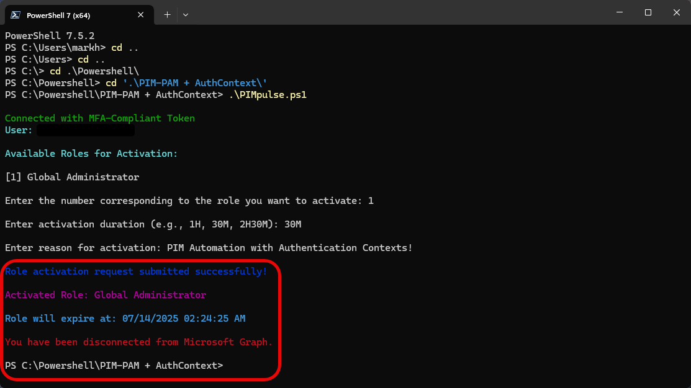

# 🔐 PIM-Global-MST

Latest Release

> **Now available as a standalone `.exe`** in v3.0.0 – no PowerShell required, with Microsoft Teams integration.

PIM-Global-MST is a lightweight, secure desktop utility designed to streamline Entra ID Privileged Identity Management (PIM) role activation with Microsoft Teams notifications and approval workflows.

---

> 🚀 **Enhanced Version Released!**  
> `PIM-Global-Teams-v2.ps1` now supports **Microsoft Teams integration**, **Power Automate workflows**, **phishing-resistant passwordless MFA**, **multi-role operations**, and **active role detection**.  
> View the [configuration guide](CONFIGURATION.md) →

## 🚀 Key Features

### **Advanced Authentication**
* 🔐 **Phishing-resistant passwordless MFA** with platform and portable passkeys
* 🔄 **Authentication Context handling** - seamless conditional access management
* 🌍 **Multi-tenant support** across global deployments
* 🛡️ **MSAL & Microsoft.Graph-based** secure authentication

### **Enhanced PIM Management**
* ✅ **Portable executable** — no script editing or PowerShell knowledge required
* 📋 **Dual-mode operation** — role activation and deactivation in one unified tool
* 🔍 **Active role detection** — automatically identifies currently active roles
* ⚡ **Multi-role operations** — activate or deactivate multiple roles simultaneously
* 🔄 **Interactive session mode** — multiple operations without re-authentication
* 🎨 **Color-coded output** — enhanced visual feedback and error handling

### **Microsoft Teams Integration**
* 📱 **Rich adaptive cards** for role activation notifications
* 🔔 **Approval workflow cards** for roles requiring approval
* ⏰ **Timezone-aware timestamps** with proper abbreviations
* 🎯 **Separate channels** for notifications vs approvals
* 🔄 **Power Automate integration** for automated approval workflows

---

## 🔐 Permissions

When you run the tool for the first time, Microsoft will prompt you to sign in and approve access to Microsoft Graph permissions:

| Permission | Why It's Needed |
|------------|----------------|
| User.Read | To identify you and sign in securely |
| GroupMember.Read.All | To read group-based PIM role eligibilities |
| RoleManagement.Read.Directory | To view which PIM roles you're eligible for |
| RoleManagement.ReadWrite.Directory | To activate/deactivate eligible roles on your behalf |
| Directory.Read.All | To read directory information for role operations |

📌 These permissions are **delegated** meaning they only apply while you're signed in interactively using MFA.

👉 If you're the first person in your tenant to use the tool, Microsoft Entra may ask your admin to approve the requested permissions. This is a one-time step built into the Microsoft sign-in experience – no separate setup or consent URL is needed.

---

## ✅ Requirements

### **Mandatory**
* Windows 10/11 (x64)
* PowerShell 7+ (automatically detected)
* Entra ID Premium P2 license (for PIM functionality)
* Eligible PIM roles in your tenant

### **Optional (for Teams integration)**
* Microsoft Teams access
* Teams channel management permissions
* Power Automate Premium license (for approval workflows)

### **Auto-installed Dependencies**
The tool automatically installs required PowerShell modules:
* `Microsoft.Graph` - Graph API PowerShell SDK
* `MSAL.PS` - Microsoft Authentication Library

---

## 🧑‍💻 Usage

### **Option A** — Download Portable Executable (Recommended)

1. **Download** `PIM-Global-MST.exe` from [releases](https://github.com/markorr321/PIM-Global-MST/releases)
2. **Run** the executable - no installation required
3. **Follow** the authentication prompts
4. **Configure** Teams integration (optional) - see [configuration guide](CONFIGURATION.md)

### **Option B** — Run PowerShell Script Directly

**Run once via GitHub:**
```powershell
iex "& { $(irm https://raw.githubusercontent.com/markorr321/PIM-Global-MST/main/PIM-Global-Teams-v2.ps1) }"
```

**Clone and run locally:**
```bash
git clone https://github.com/markorr321/PIM-Global-MST.git
cd PIM-Global-MST
.\PIM-Global-Teams-v2.ps1
```

---

## 🧠 Example Workflow

### 🟢 Launch the Tool


### 👤 Account Selection


### 🔑 Passkey Authentication


### 📷 QR Code Verification


### ✅ MFA Confirmation


### 🎭 Role Selection


### 🧾 Role Configuration


### ⏳ Duration Selection


### 📝 Justification


### 🖥️ Script Interaction


---

## 🔧 Configuration

### **Basic Setup (No Teams)**
The tool works out-of-the-box for PIM functionality. To disable Teams notifications:

1. Set `$enableTeamsNotifications = $false` in the script
2. Or ignore the friendly "workflow not configured" messages

### **Teams Integration Setup**
For full Teams integration with notifications and approval workflows:

📖 **[Complete Configuration Guide](CONFIGURATION.md)**

Key setup steps:
1. **Create Teams webhooks** in your notification channels
2. **Configure webhook URLs** in the script
3. **Set up Power Automate flows** for approval automation (optional)
4. **Test the integration** with a role activation

---

## 🔐 Security Features

This tool implements enterprise-grade security:

* **MSAL interactive login** with ACRS enforcement (`acrs=c1`)
* **Phishing-resistant MFA** support (passkeys, Windows Hello, FIDO2)
* **No passwords or secrets stored** - uses secure token-based authentication
* **Conditional Access compliance** - handles authentication contexts seamlessly
* **Temporary file cleanup** - no permanent files left on system
* **Delegated permissions only** - works within user's existing permissions

---

## 🛠️ Advanced Features

### **Multi-Role Operations**
- Activate or deactivate multiple roles in a single session
- Batch processing for efficient role management
- Smart role conflict detection

### **Interactive Session Mode**
- Perform multiple PIM operations without re-authentication
- Session state management across operations
- Automatic token refresh handling

### **Teams Workflow Integration**
- Rich adaptive cards with role details and timestamps
- Separate notification channels for different role types
- Power Automate approval automation
- Timezone-aware notifications

### **Error Handling & User Experience**
- Color-coded console output for better readability
- Comprehensive error messages with suggested solutions
- Graceful fallback when Teams integration isn't configured
- Real-time API synchronization with Azure PIM

---

## 📋 Troubleshooting

### Common Issues

**"Teams workflow not configured" messages**
- These are friendly warnings - PIM functionality still works
- Configure Teams integration or set `$enableTeamsNotifications = $false`

**PowerShell 7+ not found**
- Download from [PowerShell releases](https://github.com/PowerShell/PowerShell/releases)
- The tool checks common installation paths automatically

**No eligible roles found**
- Verify you have PIM role assignments in Azure Portal → PIM → My Roles
- Check that roles aren't already active

📖 **[Full Troubleshooting Guide](CONFIGURATION.md#troubleshooting)**

---

## 📜 License

MIT License

---

## 🤝 Support & Contributing

### **Get Help**
* 🐛 **Bug Reports**: [GitHub Issues](https://github.com/markorr321/PIM-Global-MST/issues)
* 💬 **Questions**: [GitHub Discussions](https://github.com/markorr321/PIM-Global-MST/discussions)
* 📧 **Development Opportunities**: morr@orr365.tech
* 🐦 **Twitter**: [@MarkHunterOrr](https://twitter.com/MarkHunterOrr)

### **Sponsor Development**
* 💖 **GitHub Sponsors**: [Support this project](https://github.com/sponsors/markorr321)
* ⭐ **Star this repo** to show your support

---

## 🔗 Related Projects

* **[PIM-Global](https://github.com/markorr321/PIM-Global)** - Original PowerShell-only version
* **[PIM-Global-MST](https://github.com/markorr321/PIM-Global-MST)** - This project (executable + Teams integration)

---

*Made with ☕ 3 cups of coffee and 🥤 6 diet cokes by [Mark Orr](https://github.com/markorr321)*  
*Dedicated to Courtney and Aubrey* 💜